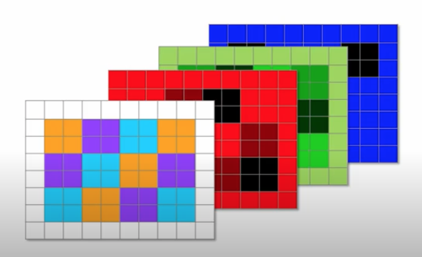
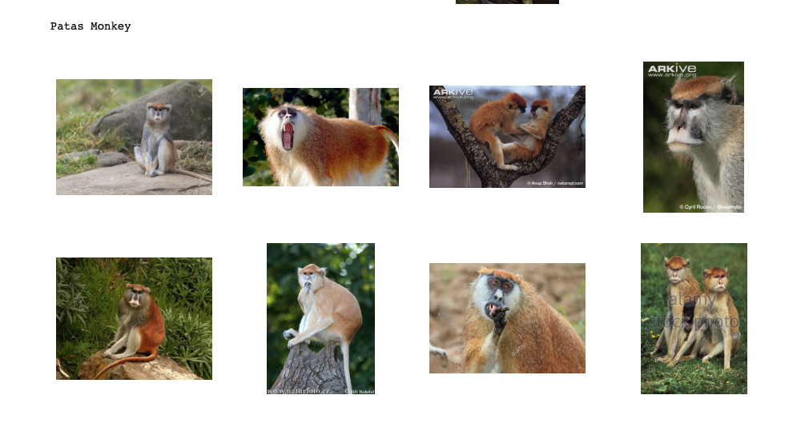
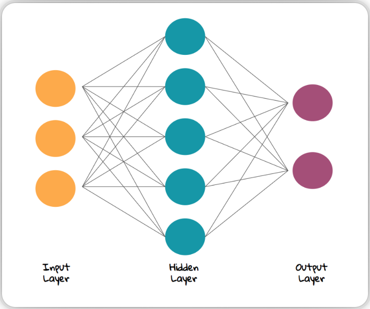
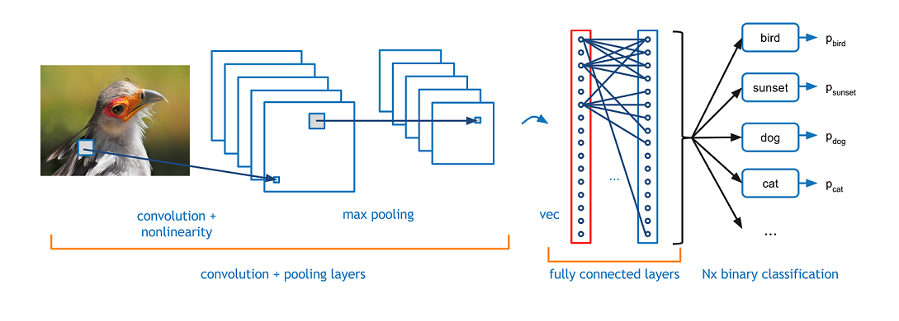
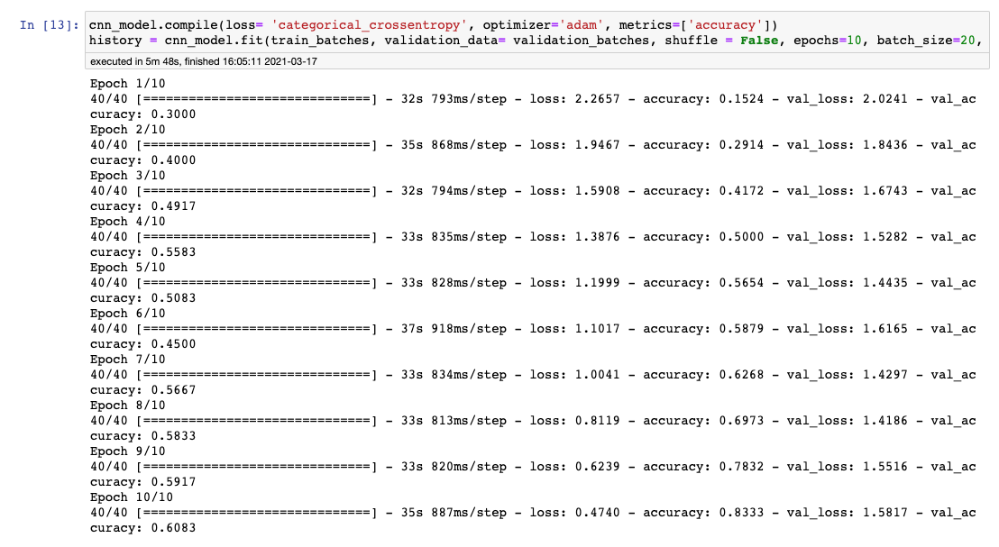
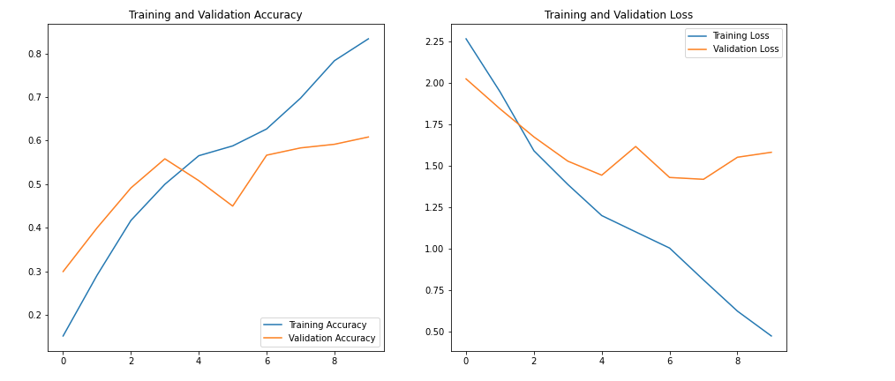
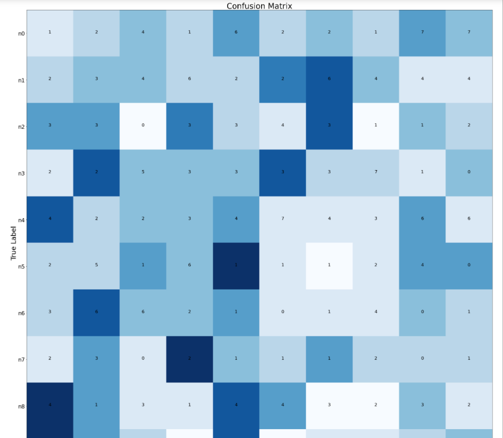
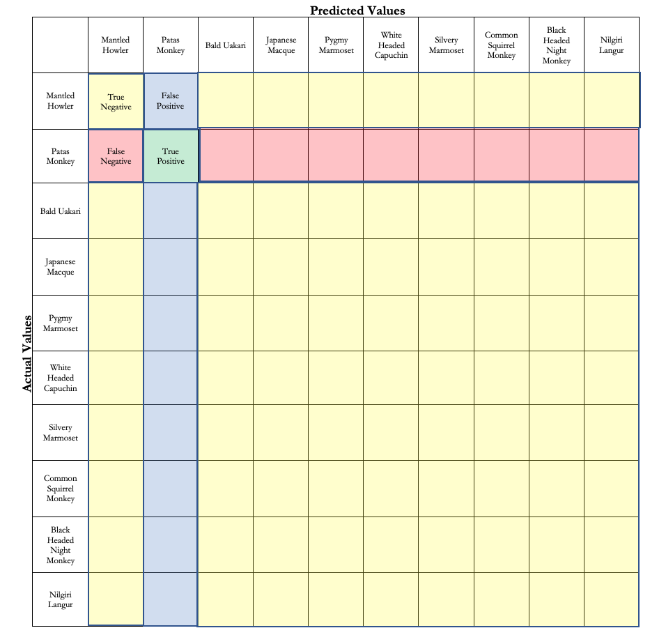
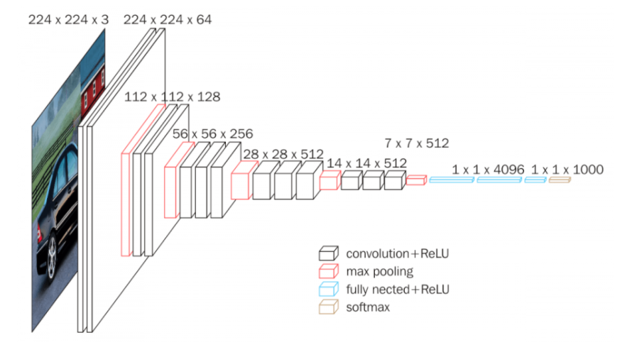

# Monkey_Image_Classification

## 1 Using Image Classification for 10 Species of Monkeys

The uses for image classification are endless. This project outlines the application of image classification to zoology, specifically for 10 species of Monkeys. This type of modelling would allow scientists to observe animals in the wild. On a sophisticated level it would allow the ability to identify individual animals. This opens up the possibility of tracking specific groups and individuals without invasive marking or tagging.

### 1.1 The Data

|Label|Common Name|Latin Name|
|---|---|---|
|n0|Mantled Howler|Alouatta Palliata|
|n1|Patas Monkey|Erythrocebus Pata|
|n2|Bald Uakari|Cacajao Calvus|
|n3|Japanese Macaque|Macaca Fusacata|
|n4|Pygmy Marmoset|Cebuella Pygmea|
|n5|White Headed Capuchin|Cebus Capucinus|
|n6|Silvery Marmoset|Mico Argentatus|
|n7|Common Squirrel Monkey|Saimiri Sciureus|
|n8|Black Headed Night Monkey|Aotus Nigriceps|
|n9|Nilgiri Langur|Trachypithecus Johnii|

The original data can be found at : https://www.kaggle.com/slothkong/10-monkey-species

This data set contains over 1000 images of 10 different monkey speicies. It was originally divided into training and testing. For the purposes of validation I extracted 12 photos of each species from the training file (the largest), and organized them into folders by species. The corresponding numbers with species is displayed in the table above. These files are on my local desktop and would need to be extracted from the website to the local server with corresponding paths.

#### 1.1.1 Visualizing the Data in Jupyter Notebook

For images to become a usable vector they must be broken down into smaller pieces and numericized.  Images are separated out into 3 layers of color: red, green, and blue.  Each layer has has its own unique pixels that get graded on their lightness or darkness on a scale of 0 to 255 with 255 being maximum light.  Once each Pixel has a corresponding value they can be analyzed as vectors and run through algorithms.

Here is where we successfully created a path from the desktop to Jupyter Notebook with corresponding labels.  The labels in this are particularly important for the computer to learn what each thing is.

### 1.2 Building the MLP Model

Multilayer Perceptrons, or MLPs for short, are the classical type of neural network. They are comprised of one or more layers of neurons. Data is fed to the input layer, there may be one or more hidden layers providing levels of abstraction, and predictions are made on the output layer, also called the visible layer.

Below is the basic architecture of a neural network.

This is the most basic format of a neural network.  The accuracy for this model was so low that it didn't even seem worth proceeding with.  An accuracy of ths model was 10% and even less for validation.

### 1.3 Building a Conveluted Neural Network

Essentially in a conveluted neural network is breaking apart the images into smaller pieces and attempting to recognize them for their individual and unique parts and then restructure it, just like the human brain might do.  This allows the computer to define the unique attributes that define each classification.

**Convolutional Layer** The convolutional layer is the layer wehre where the computer quite literally convolutes the images, breaking it down into smaller pieces

**Pooling layer** After and between the convolutionalyer is the pooling layer where the computer quite literally pools the pieces of the images back together .  This layer helps prevent overfitting.

**Relu Correction** Relu or Rectified linear unit, is an activation function. In a neural network, the activation function is responsible for transforming the summed weighted input from the node into the activation of the node or output for that input.  Relu tends to do this in a piecewise manor making it perform well.

**Fully Connected Layer** Fully Connected Layer is simply, feed forward neural networks. Fully Connected Layers form the last few layers in the network. The input to the fully connected layer is the output from the final Pooling or Convolutional Layer, which is flattened and then fed into the fully connected layer.

#### 1.3.1 The Results

The accuracy of this hand built CNN model was up in the eightes most of the time but the validation was considerably lower.

Test Accuracy: 83%
Validation Accuracy: 60%

In the graph above we can visually see that the graph is overfit.

The confusion matrix above was so large that it couldnt be captured with a screen shot so parts of it are missing.  Because of the mediocrity of this graph 

Above is an Example of how to read the confusion matrix for the Patas Monkey.  The same method can be followed suit going down the left to right diagonal of the matrix with the respective columns and rows treated accordingly.

### 1.4 Transfer Learning using Vgg16

Total and utter fail.

Transfer learning is a machine learning method where a model developed for a task is reused as the starting point for a model on a second task.  Transfer learning can be used to speed up the learning process and heighten the accuracy. 
The award winning VGG16 model was developed at Oxford in 2014 by the Visual Geometry Group.  Hence, its name.  The model was trained on 1000 different classes with over 10 million parameters and 95% accuracy.  It has become a sought after model ever since.  This model is a highly advanced CNN model.

The idea behind this was that we should be able to take the prebuilt and trained model from vgg16, remove the output layer, and add in our own output layer using out data.

The building of the model went well but there are still many errors occuring when run through the call .fit or .fit_generator.
Until this bug is solved this model is not usable.  

### 1.5 Moving Forward

1. Augmentation - Augmentation is a process in which the computer creates extra training data out of frankensteined versions of the existing data.  This gives the computer more images to train on, hopefully increasing the accuracy.  Since we want the accuracy to go up and do not have the ideal amount of photos for each speices, this would be a great option.

2. Regularization - Regularization is a technique that helps prevent overfitting by penalizing a model for having large weights. Essentially, a model has large weights when it isn't fitting appropriately on the input data. The L1 and L2 Regularization techniques could be applied.

3. Once technical kinks are smoothed out, this could be a promising way of implementing non invasive animal observation in the wild.
